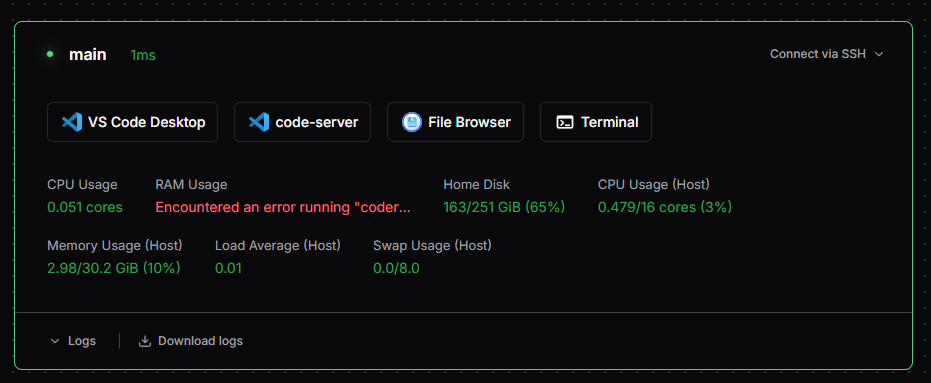

# Coder Server (Docker Compose)

Docker Compose 一発で立ち上がる Coder サーバー。

DinD (Docker in Docker) 構成なので、ホストに Docker さえあれば Coder + ワークスペース環境がまるごと動く。ワークスペース内でも `docker` コマンドが使える。個人利用・検証向け。

## 起動

```sh
docker compose up -d
```

`.env` なしでもデフォルト値で起動する。http://localhost:7080 を開く。

## 構成

| サービス | イメージ | 役割 |
|----------|---------|------|
| `coder` | `ghcr.io/coder/coder:latest` | Coder 本体 |
| `dind` | `docker:dind` | Docker デーモン (ワークスペースを管理) |
| `database` | `postgres:17` | データストア |

### ポートを dind 側で公開している理由

Coder は `network_mode: "service:dind"` で DinD とネットワーク名前空間を共有している。こうすると Coder からワークスペースコンテナに `localhost` で到達できる。代わりに Coder 自身にはポートを割り当てられないので、`7080` の公開は DinD 側で行っている。

## セキュリティ

> **Warning**
> DinD は `privileged: true` で動くのでコンテナ分離は効かない。個人利用・検証用途向け。信頼できないユーザーがいる環境には向かない。

### 既知の制限: RAM Usage が取得できない

DinD 内のコンテナでは cgroup v2 が threaded モードになるため、`coder stat mem` でコンテナのメモリ使用率を取得できない。ダッシュボードの RAM Usage 欄はエラー表示になる。



## CLI セットアップ

サーバー起動後、CLI を入れてテンプレートを push する。

### Windows

```powershell
winget install Coder.Coder
coder login http://localhost:7080
coder templates push docker --directory .\templates\docker-in-docker
```

### macOS

```sh
brew install coder
coder login http://localhost:7080
coder templates push docker --directory ./templates/docker-in-docker
```

### Linux

```sh
curl -fsSL https://coder.com/install.sh | sh
coder login http://localhost:7080
coder templates push docker --directory ./templates/docker-in-docker
```

## テンプレート

[templates/docker-in-docker/](templates/docker-in-docker/) — AI コーディングツール・日本語環境入りのワークスペーステンプレート。
