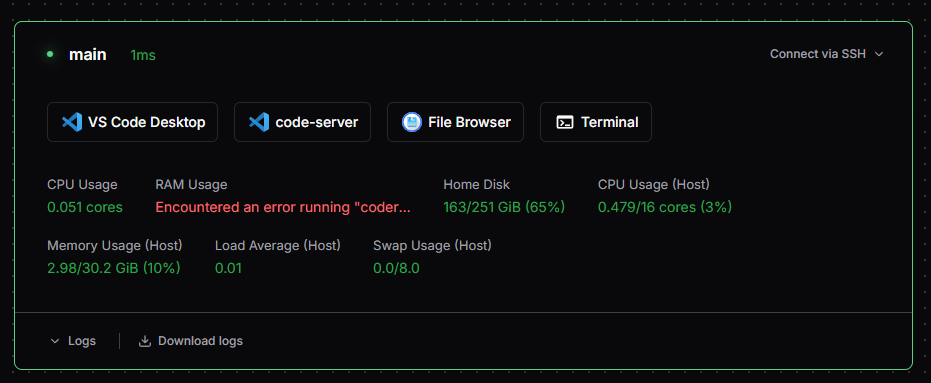

# Coder Server (Docker Compose)

Docker Compose 一発で立ち上がる Coder サーバー。

DinD (Docker in Docker) 構成なので、ホストに Docker さえあれば Coder + ワークスペース環境がまるごと動く。ワークスペース内でも `docker` コマンドが使える。個人利用・検証向け。

## 起動

```sh
docker compose up -d
```

`.env` なしでもデフォルト値で起動する。http://localhost:7080 を開く。

## 構成

| サービス | イメージ | 役割 |
|----------|---------|------|
| `coder` | `ghcr.io/coder/coder:latest` | Coder 本体 |
| `dind` | `docker:dind` | Docker デーモン (ワークスペースを管理) |
| `database` | `postgres:17` | データストア |

### ポートを dind 側で公開している理由

Coder は `network_mode: "service:dind"` で DinD とネットワーク名前空間を共有している。こうすると Coder からワークスペースコンテナに `localhost` で到達できる。代わりに Coder 自身にはポートを割り当てられないので、`7080` の公開は DinD 側で行っている。

## セキュリティ

> **Warning**
> DinD は `privileged: true` で動くのでコンテナ分離は効かない。個人利用・検証用途向け。信頼できないユーザーがいる環境には向かない。

### 既知の制限: RAM Usage が取得できない

DinD 内のコンテナでは cgroup v2 が threaded モードになるため、`coder stat mem` でコンテナのメモリ使用率を取得できない。ダッシュボードの RAM Usage 欄はエラー表示になる。



## CLI セットアップ

サーバー起動後、CLI を入れてテンプレートを push する。

### Windows

```powershell
winget install Coder.Coder
coder login http://localhost:7080
coder templates push dev-tools --directory .\templates\dev-tools
```

### macOS

```sh
brew install coder
coder login http://localhost:7080
coder templates push dev-tools --directory ./templates/dev-tools
```

### Linux

```sh
curl -fsSL https://coder.com/install.sh | sh
coder login http://localhost:7080
coder templates push dev-tools --directory ./templates/dev-tools
```

## テンプレート

[templates/standard-develop/](templates/standard-develop/) — Codex、Claude、GitHub CLI、tmux、DinD、code-server入りの標準ワークスペーステンプレート。MDXは含みません。

[templates/dev-tools/](templates/dev-tools/) — code-server、開発CLI、MDX CLI と skills 入りのワークスペーステンプレート。

## Standard Develop（デフォルト）

```sh
coder login https://coder.mizuame.app
coder templates push standard-develop --directory ./templates/standard-develop --yes
coder templates edit standard-develop --display-name "Standard Develop" --description "Default development workspace with Codex, Claude, GitHub CLI, tmux, DinD, and code-server" --yes
```


## Developer Tools + MDX（全ユーザー向け）

[templates/dev-tools/](templates/dev-tools/) は code-server（AI拡張なし）、File Browser、tmux、GitHub CLI、Codex CLI、Claude Code CLI、MDX CLI と MDX skills を提供します。

```sh
coder login https://coder.mizuame.app
coder templates push dev-tools --directory ./templates/dev-tools
coder templates edit dev-tools --display-name "Developer Tools + MDX"
```

新規テンプレートには既定でEveryoneの閲覧・利用権限が付くため、新規ユーザーを含む全ユーザーが選択できます。GitHub組織によるログイン制限はCoderサーバー側の設定を引き継ぎます。

初回ワークスペース作成時、接続先Dockerデーモンで同梱Dockerfileをビルドします。ホストへの事前イメージ配置は不要です。以後はDockerのビルドキャッシュを利用します。MDXのソースはコミットに固定し、CodexとClaudeは指定の公式インストーラーを使用します。各サービスの認証情報は同梱しません。
